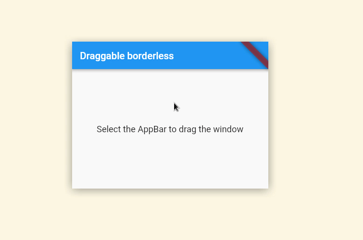

# draggable_borderless

A [go-flutter-desktop](https://github.com/go-flutter-desktop/go-flutter/wiki/Plugin-info) GLFW plugin example.  
In this example we are answering issue [#214](https://github.com/go-flutter-desktop/go-flutter/issues/214): *"how to drag undecorated window".*  

go-flutter has multiples [option](https://github.com/go-flutter-desktop/go-flutter/wiki/Options), one of them been [`flutter.WindowMode(flutter.WindowModeBorderless)`](https://github.com/go-flutter-desktop/examples/blob/f6eddd4e0051944ab41b0a9e12d8a4a0d0af2fdd/draggable_borderless/desktop/cmd/options.go#L11).  
This example uses this option, which hide the window decoration (title bar, close/maximize/.. buttons) making the window un-draggable using 'classic' mouse interaction. 

To solve this limitation a [`GLFW-Plugin`](https://github.com/go-flutter-desktop/go-flutter/wiki/GLFW-Plugin-example) has been written.

The GLFW answer comes from https://stackoverflow.com/a/46205940 with a little
twist.  
The window is only draggable from the [Flutter AppBar](https://api.flutter.dev/flutter/material/AppBar-class.html) widget.

The source code of the plugin has been placed directly in the [`go/cmd/options.go`](./go/cmd/options.go) file.  
A custom `AppBar` widget has been created, the source code is available in the
[`lib/main_desktop.dart`](./lib/main_desktop.dart) file.

## Demo

  

