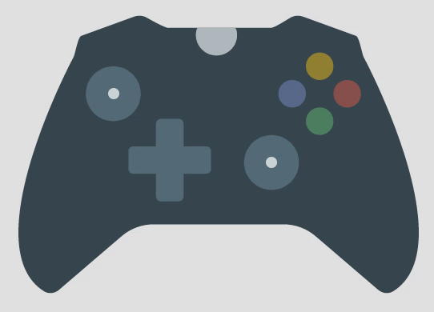

# xbox_controller

A project demonstrating:
  - The [EventChannel](https://godoc.org/github.com/go-flutter-desktop/go-flutter/plugin#EventChannel) specialized platform channel.

The demo uses the game engine [flame](https://github.com/flame-engine/flame).

## Demo

  

